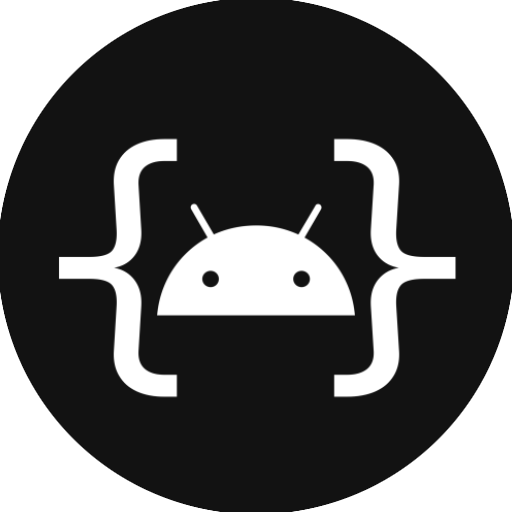

  

<h2 align="center"><b>AndroidIDE</b></h2>

  Un IDE para desarrollar aplicaciones Android reales basadas en Gradle en dispositivos Android.

 

<!-- Compilación y prueba -->

<!-- CodeFactor -->

<!-- Crowdin -->

<!-- Licencia -->

> **Estamos buscando colaboradores/mantenedores para ayudar a mantener vivo el proyecto y acelerar el desarrollo. Puedes ayudar corrigiendo errores, implementando y mejorando funciones, escribiendo documentación, etc.**

## Características

- [x] Soporte para Gradle.
- [x] `JDK 11` y `JDK 17` disponibles para su uso.
- [x] Terminal con paquetes necesarios.
- [x] Variables de entorno personalizadas (para Build & Terminal).
- [x] SDK Manager (disponible a través del terminal).
- [x] Información de API para clases y sus miembros (desde, eliminado, obsoleto).
- [x] Lector de registros (muestra los registros de tu aplicación en tiempo real).
- [ ] Servidores de lenguaje
    - [x] Java
    - [x] XML
    - [ ] Kotlin
- [ ] Diseñador de interfaz de usuario
    - [x] Inflador de diseño
    - [x] Resolver referencias de recursos
    - [x] Autocompletar valores de recursos cuando el usuario edita atributos mediante el editor de atributos
    - [x] Arrastrar y soltar
    - [x] Editor de atributos visual
    - [x] Widgets de Android
- [ ] Traductor de cadenas
- [ ] Asset Studio (Creador de imágenes y iconos)
- [x] Git

## Instalación

> _Instala AndroidIDE solo desde fuentes confiables, es decir,_
> - [_El sitio web de AndroidIDE_](https://androidide.netlify.app)
> - [_F-Droid_](https://f-droid.org/packages/com.itsaky.androidide/)

- Descarga el APK de AndroidIDE desde las fuentes confiables mencionadas.
- Sigue las
  instrucciones [aquí](https://docs.androidide.com/tutorials/get-started.html) para
  instalar las herramientas de compilación.

## Limitaciones

- Para trabajar con proyectos en AndroidIDE, tu proyecto debe utilizar la versión 7.2.0 o
  más reciente del Plugin de Gradle para Android. Los proyectos con versiones antiguas del AGP deben migrarse a versiones más recientes.
- El SDK Manager ya está incluido en el SDK de Android y es accesible en AndroidIDE a través de su Terminal.
  Sin embargo, no puedes usarlo para instalar algunas herramientas (como NDK) porque esas herramientas no están construidas para
  Android.
- No hay soporte oficial para NDK porque no hemos construido el NDK para Android.

La aplicación aún se encuentra en desarrollo activo. Está en fase beta y puede no ser estable. Si tienes algún
problema usando la aplicación, avísanos.

## Contribuir

Consulta la [guía de contribución](./CONTRIBUTING.md).

Para traducciones, visita la [página del proyecto en Crowdin](https://crowdin.com/project/androidide).

## Agradecimientos a

- [Rosemoe](https://github.com/Rosemoe) por el
  impresionante [CodeEditor](https://github.com/Rosemoe/sora-editor)
- [Termux](https://github.com/termux) por el [Terminal Emulator](https://github.com/termux/termux-app)
- [Bogdan Melnychuk](https://github.com/bmelnychuk)
  por [AndroidTreeView](https://github.com/bmelnychuk/AndroidTreeView)
- [George Fraser](https://github.com/georgewfraser) por
  el [Java Language Server](https://github.com/georgewfraser/java-language-server)

Gracias a todos los desarrolladores que han contribuido a este proyecto.

Este proyecto cuenta con el apoyo de:

  

## Contáctanos

- [Sitio web](https://androidide.netlify.app/)
